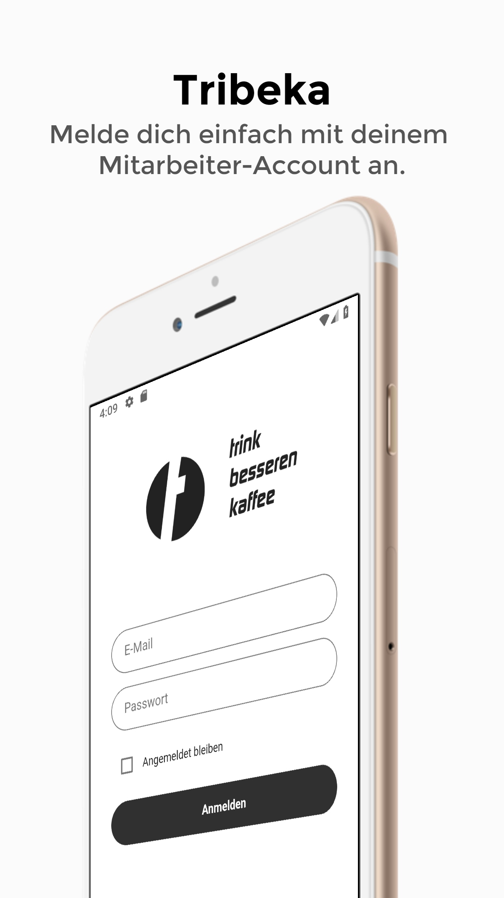
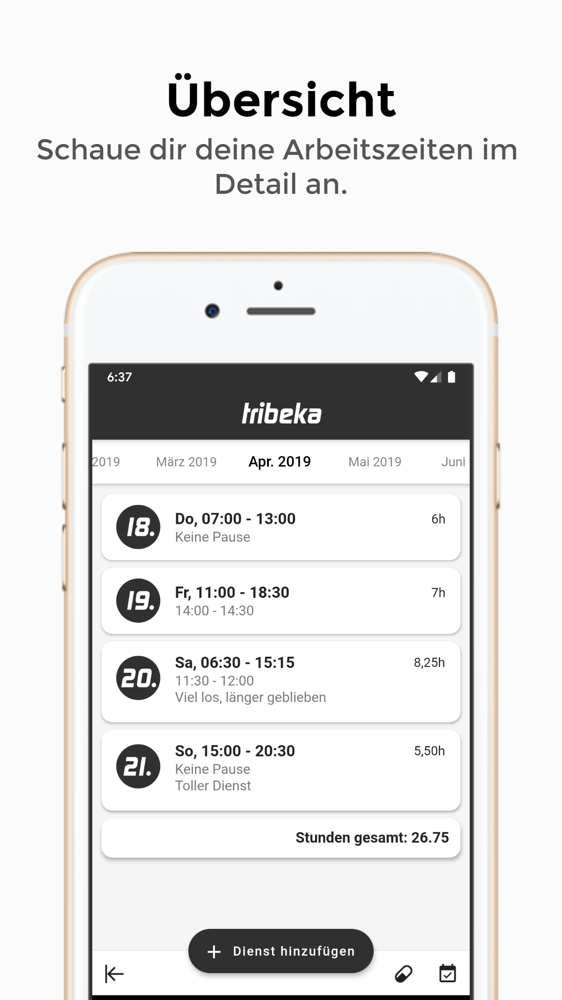
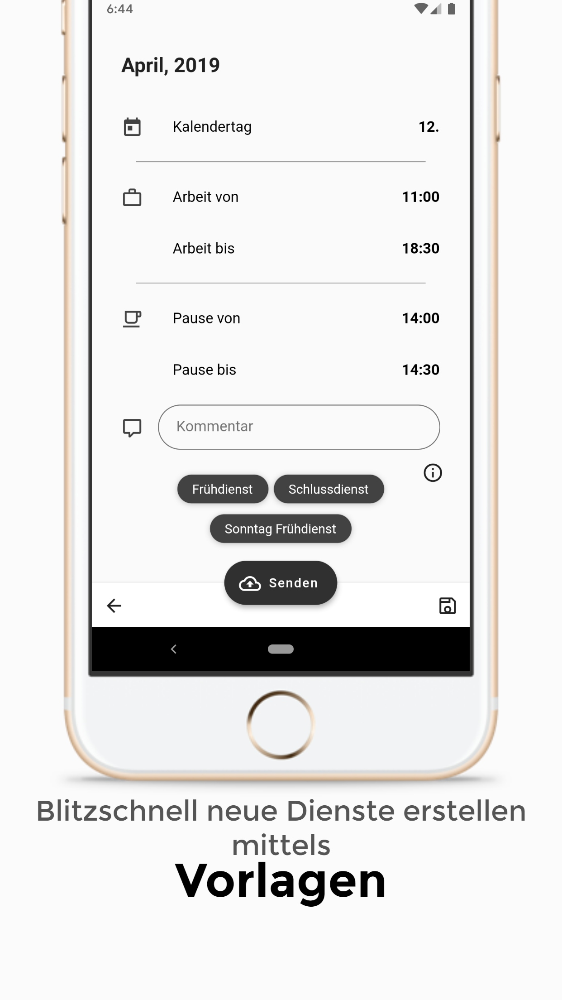

# Tribeka-App

## Was beinhaltet dieses Projekt?

Dies ist das Git Repository für die **Projektarbeit/Bachlorarbeit** von **Andreas Feichtinger**, SWD17.

Inhalt dieses Projektes ist eine auf dem Framework Flutter basierende App, welche es mobilen Geräten erlaubt die Arbeitsstunden in der Firma Tribeka festzuhalten.
**Wichtig ist hierbei, dass es zwingend notwendig ist Zugang zu einem existierenden Account zu haben.** Da keine API zur Verfügung steht wird über die App mit dem Webserver kommuniziert, wobei die Response des Servers von der App analysiert wird. Mittels Web-Scraping werden die relevanten Daten extrahiert und zu leicht bearbeitbaren Objekten umgewandelt.

**Ziel** dieses Projektes ist es, das Eintragen der Arbeitsstunden so einfach und schnell wie möglich abzuwickeln. Aus diesem Grund ist es möglich innerhalb der App selbst Vorlagen abzuspeichern, wodurch der Benutzer seine Arbeitszeiten innerhalb von wenigen Sekunden aufzeichnen kann.

Abgesehen von Flutter und Dart werden folgende Dependencies (pubspec.yaml) verwendet:

* [**html:**](https://api.dartlang.org/stable/2.2.0/dart-html/dart-html-library.html) für das Parsen der HTML Response und somit für das Web-Scraping.
* [**dio:**](https://pub.dartlang.org/packages/dio) als HTTP-Client welcher sowohl mit Cookies als auch mit Fehlern umgehen kann.
* [**flutter_secure_storage:**](https://pub.dartlang.org/packages/flutter_secure_storage) um sicherheitskritische Daten verschlüsselt zu speichern z.B Passwort
* [**shared_preferences:**](https://pub.dartlang.org/packages/shared_preferences) um normale Daten zu speichern z.B Fertiggestellte Monate
* [**intl:**](https://pub.dartlang.org/packages/intl) für die Übersetzung der Namen der Monate.
* [**flutter_picker:**](https://pub.dev/packages/flutter_picker) für die Auswahl des Kalendertages, da die CupertinoPicker library dies noch nicht unterstützt.
* [**material_design_icons_flutter:**](https://pub.dartlang.org/packages/material_design_icons_flutter) Um die Material Icons nutzen zu können (Bietet mehr Umfag als die in Flutter enthaltenen Material Icons)
* [**flutter_offline:**](https://pub.dartlang.org/packages/flutter_offline) Um zu erkennen wenn keine Internetverbindung vorhandten ist.
* [**url_launcher:**](https://pub.dev/packages/url_launcher) Zum öffnen von der Dialer, Email oder SMS App.
* [**package_info:**](https://pub.dev/packages/package_info) Um auf Informationen über die App selbst (z.B Version) zugreifen zu können.

Weiters sind folgende Dependencies nicht in der pubspec.yaml zu finden, sondern im Verzeichnis "lib/widgets".
* [**month_picker_strip:**](https://github.com/mahmed8003/month_picker_strip) Von mir verändert um das Aussehen anzupassen.
* [**flutter_tags:**](https://github.com/Dn-a/flutter_tags) Von mir verändert um das Aussehen anzupassen sowie die LongPress Funktion zu verwenden.
* [**flutter_slidable:**](https://pub.dev/packages/flutter_slidable) Von mir verändert um das Aussehen anzupassen.

## Screenshots
Alle Screenshots finden sich im "Screenshots" Verzeichnis.

Login                                              |  Übersicht                                          |  Vorlagen
:-------------------------------------------------:|:---------------------------------------------------:|:------------------------------------------------------:
  |    |  

## Wie kann ich bei einem Update meine lokale Kopie aktualisieren?

* Falls eigene Änderungen vorhanden sind, diese speichern oder entfernen. Entfernen mit `git stash clear`.
* Das Aktualisierte Repository herunterladen mit `git pull`.
* Das Projekt öffnen und `flutter packages get && flutter packages upgrade` ausführen. (eventuell auch `flutter upgrade` um die aktuellste Version von Flutter zu installieren)
* Eventuell die alte App unter iOS oder Android deinstallieren. Danach sollte man die aktuellste Version installieren und ausführen können.

## Wie kann ich das Projekt öffnen und bearbeiten?

Es wird sowohl **Android Studio** mit zwei **Plugins (Dart** und **Flutter)** benötigt, sowie das **Framework Flutter**. Alle Teile funktioneren auf Windows, Linux und Mac OSX.
Weitere Informationen zu den einzelnen Schritten sowie Schritte zur Problemlösung finden sich auf den jeweiligen Downloadseiten, welche ebenfalls verlinkt sind.
Hier eine Schritt für Schritt Anleitung:

*  Die aktuellste Version von **Android Studio** herunterladen und installieren. Diese kann hier heruntergeladen werden: <https://developer.android.com/studio>

*  Die aktuellste Version von **Flutter** herunterladen und an einen beliebigen Ort entpacken. Flutter kann hier heruntergeladen werden: <https://flutter.dev/docs/get-started/install>

*  Flutter sollte jetzt zur **PATH Variable** hinzugefügt werden um das Framework problemlos zu nutzen. Unter Windows 10 funktioniert dies wie folgt:
    * Drücken Sie die Tastenkombination *Win + R.*
    * Schreiben Sie in das Feld: *"sysdm.cpl"* (ohne Anführungszeichen) und drücken Sie die *Enter* Taste.
    * Den Reiter *"Erweitert"* auswählen und unten auf *"Umgebungsvariablen"* drücken.
    * Hier unter Benutzervariablen *"PATH"* auswählen und auf bearbeiten drücken.
    * Rechts auf die Schaltfläche *"Neu"* drücken und den Pfad zu Flutter einfügen: In meine Fall *"C:\Users\<Benutzername>\Documents\Android\flutter\bin"*
    * Alle Fenster mit einem Druck auf *"OK"* bestätigen und nun sollte Flutter im *"PATH"* zur Verfügung stehen.

*  Öffnen Sie nun ein neues Powershell oder CMD Fenster und führen Sie folgenden Befehl aus: `flutter doctor –android-licenses`

*  Hier müssen alle Lizenzen für die Nutzung von Android und Flutter bestätigt werden, dies geschieht mit dem Drücken der *"Y"* Taste.

*  Anschließend öffnen Sie Android Studio und führen, wenn notwendig, das First-Time Setup durch. Hierbei ist es wichtig, dass eine aktuelle Android SDK installiert wird.

*  Android Studio sollte nun als Fenster geöffnet sein. Klicken Sie hier am unteren Rand auf Konfigurieren und wählen Sie Plugins aus.

*  Hier suchen Sie dann nach dem Plugin **Flutter**, wenn Sie dieses installieren, wird gefragt ob das Plugin **Dart** ebenso installiert werden soll. Lassen Sie dies zu.

*  Anschließend, sollte Android Studio neu gestartet werden. Nach dem Neustart kann man das geklonte Git-Repository öffnen. Gehen Sie dann unter Android Studio in die Kommandozeile.

*  Geben sie hier den Befehl `flutter packages get` ein um die verwendeten Dependencies herunter zu laden. Danach sollte das Projekt vollständig funktionieren.

*  Es ist zu empfehlen vor dem Kompilieren unter Android Studio in der Kommandozeile den Befehl `flutter doctor` auszuführen um zu überprüfen, ob alles funktioniert hat.

### Hinweis:
> *Dieses Projekt entsteht in Zusammenarbeit mit der Kaffehauskette Tribeka aus Graz sowie der FH JOANNEUM GmbH*
