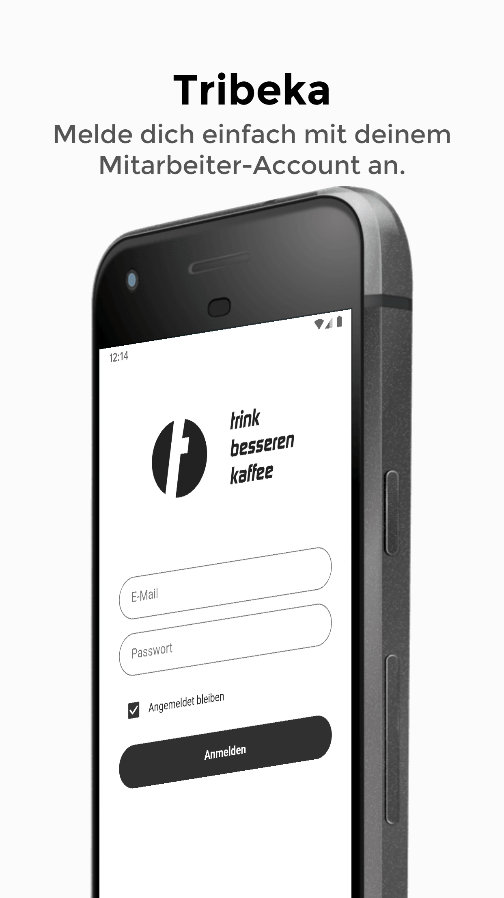
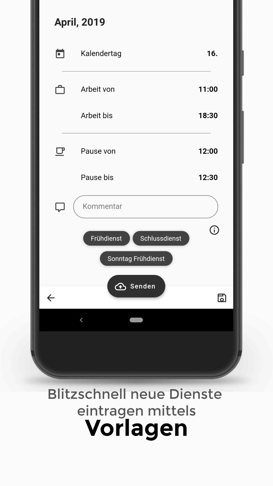

# Tribeka-App

## Content of this Repository

This is the Git repository for the **Bachlor's Thesis** of **Andreas Feichtinger**, SWD17.

The content of this project is a mobile application based on the framework Flutter, which allows users to record the working hours in the company Tribeka.
**Since there is no API available, the app communicates with the web server and the response of the server is analyzed by  means of web scraping**. The relevant data is extracted and converted into Dart objects for further processing.

The **goal** of this project is to make the recording of working hours as easy and fast as possible. For this reason, it is possible to save templates within the app itself, allowing the user to record his working hours within a few seconds.

Apart from Flutter and Dart, the following dependencies (pubspec.yaml) are used:

* [**html:**](https://pub.dev/packages/html) for parsing the HTML response and thus for web scraping.
* [**dio:**](https://pub.dartlang.org/packages/dio) as HTTP client which can handle both cookies and errors.
* [**flutter_secure_storage:**](https://pub.dartlang.org/packages/flutter_secure_storage) to store sensitive data securely. e.g. password
* [**shared_preferences:**](https://pub.dartlang.org/packages/shared_preferences) to store normal data. e.g. Completed months
* [**intl:**](https://pub.dartlang.org/packages/intl) for the translation of the names of the months.
* [**flutter_picker:**](https://pub.dev/packages/flutter_picker) for selecting the calendar day, since the CupertinoPicker library does not support this yet.
* [**material_design_icons_flutter:**](https://pub.dartlang.org/packages/material_design_icons_flutter) to be able to use the Material Icons. (Provides wider scope than stock Material Icons included in Flutter)
* [**flutter_offline:**](https://pub.dartlang.org/packages/flutter_offline) to detect when the app is connected to the internet.
* [**url_launcher:**](https://pub.dev/packages/url_launcher) to open the dialer, email or SMS app.
* [**package_info:**](https://pub.dev/packages/package_info) to access information about the app itself (e.g. version).

Furthermore, the following dependencies are not found in pubspec.yaml, but in the "lib/widgets" directory, because they had to be modified.
* [**month_picker_strip:**](https://github.com/mahmed8003/month_picker_strip) modified by me to match the theme.
* [**flutter_tags:**](https://github.com/Dn-a/flutter_tags) modified by me to match the theme as well as to use the LongPress function.
* [**flutter_slidable:**](https://pub.dev/packages/flutter_slidable) modified by me to match the theme.

## Screenshots
More screenshots can be found in the "Screenshots" directory.

Login                                              |  Overview                                          |  Templates
:-------------------------------------------------:|:---------------------------------------------------:|:------------------------------------------------------:
  |    |  

## How do I update my local copy?

* If there are own changes, save or remove them. Remove with `git stash clear`.
* Download the updated repository with `git pull`.
* Open the project and run `flutter packages get && flutter packages upgrade`. (possibly also `flutter upgrade` to install the latest version of Flutter).
* It may be necessary to uninstall the old app on iOS or Android. After that, you should be able to install and run the latest version.

## How can I open and edit the project?

Both **Android Studio** with two **Plugins (Dart** and **Flutter)** are required, as well as the **Framework Flutter**. All parts work on Windows, Linux and Mac OSX.
More information about the individual steps as well as steps to solve problems can be found on the respective download pages, which are also linked.
Here is a step by step guide:

*  Download and install the latest version of **Android Studio**. This can be downloaded here: <https://developer.android.com/studio>

*  Download the latest version of **Flutter** and unzip it to any location. Flutter can be downloaded here: <https://flutter.dev/docs/get-started/install>

*  Flutter should now be added to the **PATH variable** to use the framework without problems. Using Windows 10 this works as follows:
    * Press the key combination *Win + R.*
    * Write in the field: *"sysdm.cpl"* (without quotes) and press the *Enter* key.
    * Select the *"Advanced"* tab and press *"Environment variables"* at the bottom.
    * Here under user variables select *"PATH"* and press edit.
    * Right click on the *"New"* button and paste the path to Flutter: In my case *"C:\Users\<username>\Documents\Android\flutter\bin"*.
    * Confirm all windows by pressing *"OK"* and now Flutter should be available in *"PATH"*.

*  Now open a new Powershell or CMD window and execute the following command: `flutter doctor -android-licenses`.

*  Here all licenses for the use of Android and Flutter must be confirmed, this is done by pressing the *"Y"* key.

*  Then open Android Studio and, if necessary, perform the First-Time Setup. It is important that a current Android SDK is installed.

*  Android Studio should now be open as a window. Here, click Configure at the bottom and select Plugins.

*  Here you can search for the plugin **Flutter**, when you install it, you will be asked if you want to install the plugin **Dart** as well. Allow this.

*  Afterwards, Android Studio should be restarted. After the restart, you can open the cloned Git repository. Then go to the command line under Android Studio.

*  Enter the command `flutter packages get` to download the used dependencies. After that the project should work fully.

*  It is recommended to run the command `flutter doctor` in the command line before compiling under Android Studio to check if everything works as intended.

### Notice:
> *This project is developed in cooperation with the coffee house chain Tribeka from Graz and the FH JOANNEUM GmbH.*
